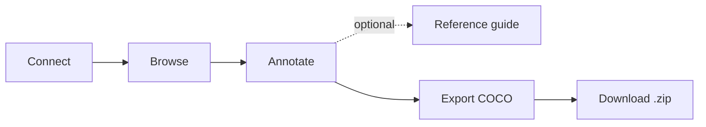

# Segmentation Annotation Studio

Draw segmentation masks on scientific images, manage classes and versions, and
export clean **COCO datasets** ready for SAM3 fine-tuning — all from your browser.

This guide walks you through everything you need to go from a fresh checkout to a
downloadable, annotated dataset:

### :material-download-box: Install
Get the tool running locally with a single command, or deploy it with Docker.

[Installation →](getting-started/installation.md){ .md-button }

### :material-rocket-launch: Quick start
The five-minute path: connect, annotate one image, and export a dataset.

[Quick start →](getting-started/quick-start.md){ .md-button }

### :material-draw: Annotate
Learn every tool — polygon, brush, smart AI (SAM), classes, slices, and versions.

[Annotate →](guide/annotate.md){ .md-button }

### :material-export: Export
Produce a COCO `.zip` with images, RLE masks, and per-class mask PNGs.

[Export & download →](guide/export.md){ .md-button }

## What is this tool?

Segmentation Annotation Studio is a manual image-segmentation workspace. It runs as a
web app with three parts working together:

| Component | Role | Default address |
| --- | --- | --- |
| **Frontend** | The React app you interact with in the browser | <http://127.0.0.1:5173> |
| **Backend** | FastAPI service that renders images, rasterizes masks, and builds exports | <http://127.0.0.1:8002> |
| **Tiled** | Data catalog that stores your source images and annotation drafts | <http://127.0.0.1:8010> |

You can point the tool at data stored in a **Tiled server** or at a **local
folder** of images (TIFF, PNG, JPG, or NPY).

## The workflow at a glance

The app is organized into tabs in the left sidebar. A typical session moves
through them in order:

1. **Connect** — choose a Tiled dataset or grant access to a local folder.
2. **Browse** — filter samples by metadata, annotation status, or star rating, then open one.
3. **Annotate** — add classes and draw masks with polygon, brush, fill, or the Smart (AI) tool.
4. **Reference** *(optional)* — write class descriptions so annotators stay consistent.
5. **Export** — pick a scope, generate the COCO dataset, and download the `.zip`.

!!! note "New here?"
    Start with [Installation](getting-started/installation.md), then follow the
    [Quick start](getting-started/quick-start.md). Each **Using the tool** page
    covers one tab in depth.
