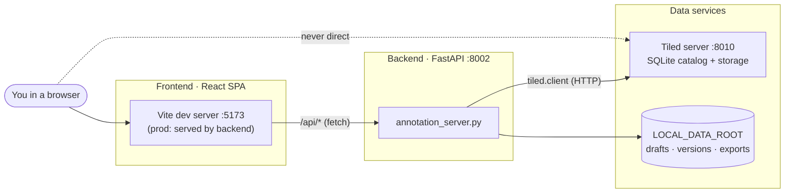
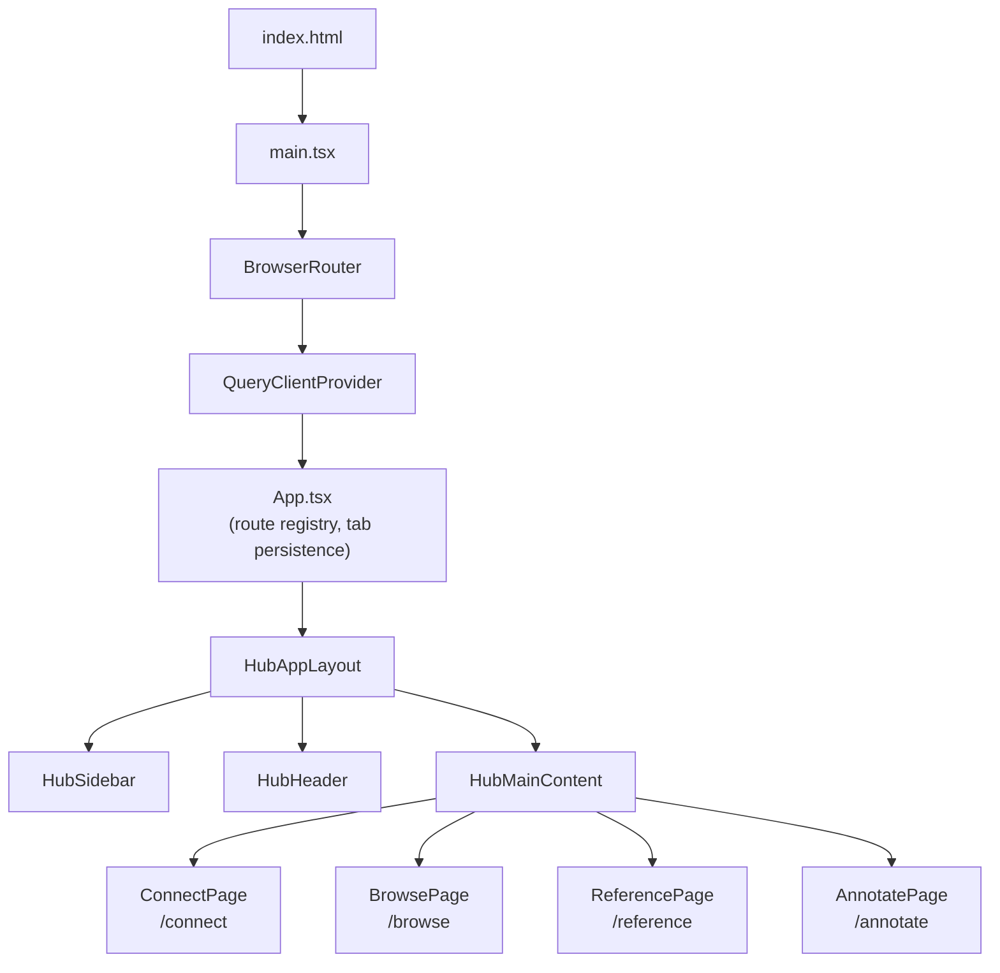
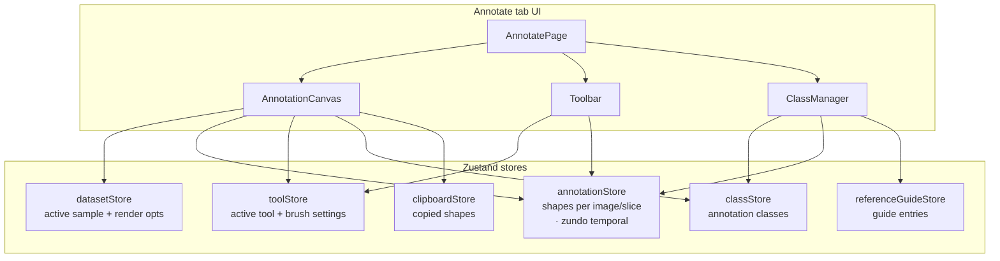
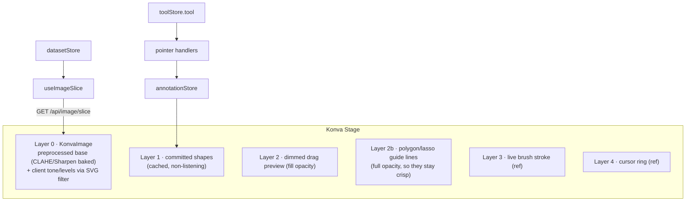
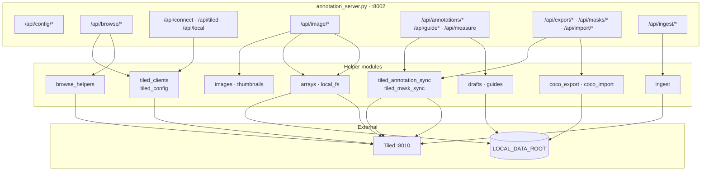
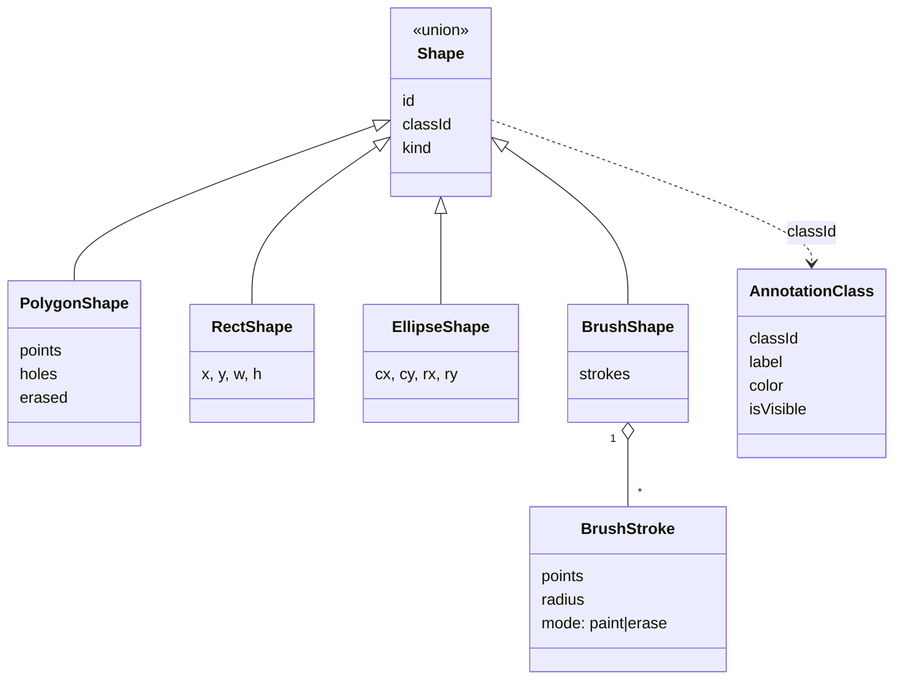
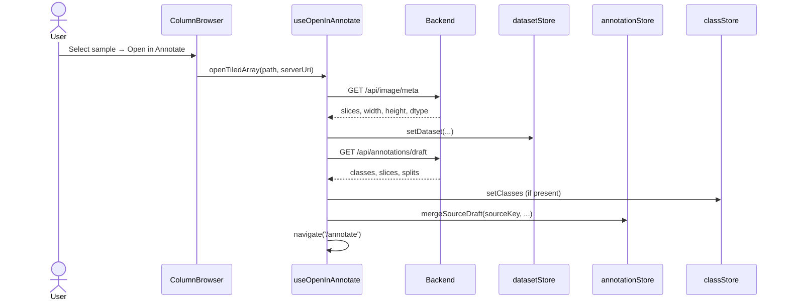
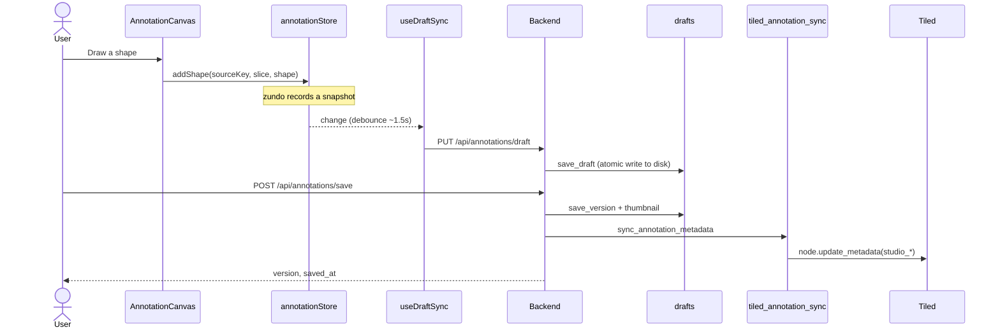
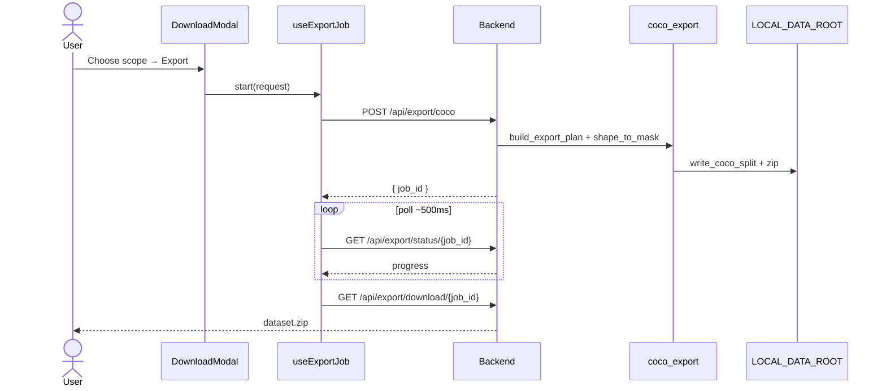

# Software architecture

This page is a developer-oriented tour of how Segmentation Annotation Studio is put
together: the major processes, the modules inside each one, and how a request
flows from a click in the browser all the way to Tiled and back.

If you only want to *use* the tool, the [Using the tool](../guide/index.md)
section is the place to start. This page is for people who want to extend,
debug, or deploy it.

## System context

The application is three cooperating processes. The browser only ever talks to
the **backend**; all catalog and array access is proxied server-side so that
Tiled credentials never reach the client.



| Component | Role | Default address |
| --- | --- | --- |
| **Frontend** | React app the annotator interacts with | <http://127.0.0.1:5173> |
| **Backend** | FastAPI: renders images, rasterizes masks, builds exports | <http://127.0.0.1:8002> |
| **Tiled** | Data catalog for source images and mask write-back | <http://127.0.0.1:8010> |

## Technology stack

=== "Frontend"

    | Layer | Technology | Used for |
    | --- | --- | --- |
    | Framework | **React 18** + **TypeScript** | UI components |
    | Build/dev | **Vite 6** | Dev server, `/api` proxy, production bundle |
    | Routing | **react-router 7** | `BrowserRouter`, tab navigation |
    | Server state | **TanStack Query 5** | Caching image slices, server lists, drafts |
    | Client state | **Zustand 5** | Nine stores (see [State management](#state-management)) |
    | Undo/redo | **zundo** | Temporal middleware on the annotation store |
    | Canvas | **react-konva** / **konva** | Drawing shapes on the image |
    | Styling | **Tailwind CSS** | Utility-first styling of the Finch shell |
    | Icons | **@phosphor-icons/react** | All UI icons |
    | AI | **@huggingface/transformers** | Segment Anything (SAM) in a Web Worker |

=== "Backend"

    | Concern | Package | Used for |
    | --- | --- | --- |
    | API | **fastapi** + **uvicorn** | HTTP framework and ASGI server |
    | Catalog | **tiled[client]** | Reading/writing the Tiled catalog |
    | Arrays | **numpy** | Mask math, statistics, downsampling |
    | Images | **pillow**, **matplotlib** | PNG encode/decode, colormaps |
    | Rasterize | **scikit-image** | Polygon/ellipse/disk rasterization, contours |
    | Export | **pycocotools** | RLE encoding, bbox/area for COCO |
    | Files | **tifffile**, **imagecodecs** | Scientific TIFF reads |
    | Config | **python-dotenv** | Loading `backend/.env` |

## Deployment topology

The dev and production layouts differ mainly in **who serves the SPA** and
**where Tiled lives**.

=== "Development"

    ```mermaid
    flowchart LR
      Browser["Browser"]
      Vite["Vite :5173"]
      Backend["FastAPI :8002"]
      Tiled["Tiled :8010"]
      Disk[("~/data")]

      Browser -->|localhost:5173| Vite
      Vite -->|"/api/* proxy"| Backend
      Backend -->|tiled.client| Tiled
      Backend --> Disk
    ```

    `start_all.sh` launches all three: Tiled (8010), backend (8002), and the
    Vite dev server (5173). Vite proxies every `/api` request to the backend,
    so the frontend uses an empty `API_BASE` and stays same-origin.

=== "Production (Docker)"

    ```mermaid
    flowchart LR
      Browser["Browser"]
      Container["Single container :8002<br/>API + static SPA"]
      TiledExt["External Tiled<br/>(TILED_URI env)"]
      Volume[("/data volume")]

      Browser -->|same origin| Container
      Container --> TiledExt
      Container --> Volume
    ```

    The build copies the compiled SPA into `backend/static/`, and FastAPI serves
    both the API and the static files from one origin on port 8002. Tiled is an
    external service referenced by `TILED_URI`; only `tiled[client]` ships in the
    image.

## Frontend architecture

### Component shell

The UI follows the ALS **Finch** hub pattern: a fixed icon sidebar, a header,
and a routed main area. Four tabs map to four page components.



| Tab | Route | Page component | Key children |
| --- | --- | --- | --- |
| **Connect** | `/connect` | `ConnectPage` | `IngestDropzone`, server/folder pickers |
| **Browse** | `/browse` | `BrowsePage` | `ColumnBrowser`, `LocalSampleBrowser` |
| **Reference** | `/reference` | `ReferencePage` | inline guide editors |
| **Annotate** | `/annotate` | `AnnotatePage` | `AnnotationCanvas`, `Toolbar`, `ClassManager` |

!!! note "Export is a modal, not a tab"
    Dataset export (COCO or DINOv3/Lightly) lives in `DownloadModal`, opened from
    the Annotate sidebar — there is no dedicated Export tab in the current navigation.

### State management

State is split across nine **Zustand** stores. Only the annotation store carries
undo/redo history (via **zundo**), and a couple of stores persist to
`localStorage`.



| Store | Holds | Persistence | Undo? |
| --- | --- | --- | --- |
| `annotationStore` | `byImage[sourceKey][slice] → Shape[]`, splits, negatives | draft autosave to backend | **zundo** |
| `toolStore` | active tool, brush size, fill/threshold, selection | memory | — |
| `datasetStore` | active sample, `meta`, `currentSlice`, `renderOpts` | memory | — |
| `classStore` | `AnnotationClass[]` (id, label, color, visibility) | in draft/save payloads | — |
| `connectionStore` | tiled/local URIs, paths, sample count | memory | — |
| `referenceGuideStore` | guide entries, notes, `loadedFor` | backend via `useGuideSync` | — |
| `clipboardStore` | copied shapes | memory | — |
| `settingsStore` | `annotatorName`, `colorblindMode`, anonymous `sessionId` | `localStorage` | — |
| `ratingStore` | per-sample star ratings | `localStorage` | — |

`toolStore` also carries the eraser/select scope (`eraseAllClasses`, `selectScope`),
the `clipToOtherClasses` (default **on**) and `mergeOverlappingSameClass` toggles,
and `panReturnTool` (so the brush/eraser cursor stays visible while hold-Space
panning). `settingsStore.sessionId` is an anonymous per-install id stamped into
the "Feedback" bug-report context.

### Canvas rendering

`AnnotationCanvas` stacks several **react-konva** layers. The in-progress brush
stroke is drawn imperatively through a ref to avoid a Zustand write on every
pointer move; it is committed to the store only on mouse-up.



Tools resolve to different interactions: `polygon`, `rectangle`, `ellipse`,
`brush`/`eraser`, `fill`, `select`, `pan`, plus AI-assisted `magic` (Segment
Anything or classic magic-wand) and `magnetic` (livewire). Pure geometry,
rasterization, region ops, and the SAM worker live under `src/lib/`.

The in-progress brush/erase stroke is drawn imperatively on Layer 3 (no store
write per pointer move); polygon and magnetic **guide lines** get their own
full-opacity layer (2b) so they read clearly even when the shape fill opacity is
turned down. Layer 0 shows a **preprocessed base** — CLAHE/Sharpen are baked into
an offscreen canvas so the tools (SAM encode, magic wand, magnetic edge map)
operate on the same enhanced image the user sees, while brightness/contrast/
levels/gamma/colormap stay on the GPU as an SVG filter over the top.

### Client-side geometry & tools (`src/lib/`)

The drawing tools are backed by small, pure, unit-tested modules — no backend
round-trip for editing:

| Module | Responsibility |
| --- | --- |
| `magicwand.ts` | Classic wand + mask→polygon vectorization (`maskToPolygons`, `maskToPolygonsWithHoles`) |
| `livewire.ts` | Magnetic-lasso edge-cost map, Dijkstra, least-cost `tracePath` |
| `rasterize.ts` | Shapes → binary mask (`rasterizeShapes`, `gridFor`, `fullResGridFor`) |
| `polybool.ts` | True polygon boolean ops (union/difference) via `polygon-clipping` — powers clip, merge, and eraser while **preserving existing vertices** |
| `clipToClasses.ts` / `mergeSameClass.ts` | Clip a new shape against other classes / union with overlapping same-class shapes |
| `regionOps.ts` / `morphology.ts` | Select-tool region ops: merge, grow, shrink, remove islands |
| `clahe.ts` / `sharpen.ts` / `stretch.ts` / `colormaps.ts` | Display-only preprocessors and LUTs |
| `geometry.ts` / `measure.ts` / `datasetStats.ts` | Hit-testing/util, measurement, and the Insights QA metrics |
| `sam/samClient.ts` · `sam/samWorker.ts` · `sam/adjust.ts` | SAM main-thread singleton, the Web Worker, and the display-bake used by tools |

## Backend architecture

The backend is a **flat module layout**: one FastAPI app (`annotation_server.py`)
declares every route directly, delegating to focused helper modules. There are no
sub-routers.



### Module responsibilities

| Module | Responsibility |
| --- | --- |
| `annotation_server.py` | FastAPI app, all HTTP routes, CORS, static SPA, caching |
| `tiled_config.py` / `tiled_clients.py` | Server config, cached clients, `api_key_for_uri`, browse-root resolution |
| `browse_helpers.py` | Metadata facets and filtered search (`tiled.queries.Key`, `distinct()`) |
| `arrays.py` / `local_fs.py` | Resolve and slice arrays from Tiled or the local filesystem |
| `images.py` / `thumbnails.py` | Slice → PNG rendering (normalize, colormap, scale) |
| `drafts.py` / `guides.py` | Autosave drafts, immutable version history, annotation guides |
| `coco_export.py` / `coco_import.py` | Shape rasterization, COCO build/write, dataset import |
| `export_jobs.py` / `ingest.py` | In-memory background-job registries |
| `tiled_annotation_sync.py` / `tiled_mask_sync.py` | Write `studio_*` metadata and rasterized mask volumes back to Tiled |

### Data model

All shape coordinates are **image pixels** — the Konva stage transform is
display-only. Shapes are shared conceptually between the frontend store and the
backend `schemas.py`.



Samples are identified by a canonical **source key**:

- Tiled — `tiled:<serverUri>:<tiledPath>`
- Local — `local:<relPath>`

The same key is used by the stores, draft autosave, versioned saves, the
annotation guide, and export, so every artifact for a sample lines up.

## Key request flows

### Open a sample for annotation

Selecting a sample in Browse loads its metadata and any existing draft, then
navigates to the Annotate tab.



### Draw, autosave, and save a version

Drawing mutates the annotation store (recorded by zundo). A debounced autosave
writes a crash-recovery **draft**; an explicit **save** creates an immutable
version and syncs metadata to Tiled.



### Export a dataset

Export runs as a background job. The client polls for status and downloads the
finished `.zip`. The `format` field selects the writer: **COCO (SAM3)**
(`write_coco_split` — RLE + images + semantic/per-class masks) or **DINOv3 /
Lightly** (`write_lightly_split` — `images/` + `masks/` label PNGs with matching
stems + `classes.json`). Both share the same rasterization and zip plumbing.



## Key design decisions

The choices below explain *why* the code looks the way it does — useful before
extending it.

- **Backend renders pixels; the browser never sees raw arrays.** `/api/image/slice`
  returns an 8-bit PNG (normalize → scale → colormap). This keeps scientific dtypes
  and Tiled credentials server-side, makes the frontend format-agnostic, and lets
  the backend expose raw intensities only where needed (e.g. `/api/measure`).
- **Shapes are stored in image-pixel coordinates.** The Konva stage transform is
  display-only, so annotations are resolution-independent and line up exactly with
  the array — no zoom-dependent rounding.
- **Display enhancement is baked for the tools, filtered for the eye.** Nonlinear
  preprocessors (CLAHE, Sharpen) are baked into an offscreen base so SAM/wand/livewire
  act on what you see; the cheap linear chain (brightness/contrast/levels/gamma/
  colormap) stays on the GPU as an SVG filter. None of it changes exported pixels.
- **Editing uses true polygon boolean geometry at full resolution.** Clip, merge, and
  erase go through `polygon-clipping` (`polybool.ts`), not a mask round-trip, so
  **untouched vertices are preserved** and repeated edits don't erode a region; the
  eraser rebuilds a polygon's vertices to match the carved outline and can split
  shapes or open holes. Rasterization uses `fullResGridFor` to avoid downsampling
  drift.
- **Brush blobs are connected components.** Overlapping strokes grow one shape; a
  disconnected stroke starts a new shape, so each blob is independently selectable.
- **AI runs in the browser, offline-first.** SAM (SlimSAM via `@huggingface/transformers`)
  runs in a Web Worker, WebGPU with a WASM fallback, loading vendored local weights
  first and only falling back to the HF CDN. No server GPU or model calls.
- **Two-tier persistence.** A debounced **draft** autosaves for crash recovery
  (`/api/annotations/draft`, disk only); an explicit **save** writes an immutable
  version + thumbnail and syncs summary metadata to Tiled. Everything is keyed by the
  canonical **source key** so drafts, versions, guide, and exports line up per sample.
- **Long work is a background job + poll.** Export, mask write-back, and ingest use an
  in-memory job registry with a `/status/{id}` poller and (for export) a streamed
  `.zip`, rather than blocking the request.

## Security boundaries

These invariants are enforced across the codebase (see `AGENTS.md`):

- **The frontend never calls Tiled directly.** Every catalog read, array slice,
  and mask write goes through the backend API.
- **Tiled API keys never reach the browser.** `/api/config/servers` returns only
  `has_api_key: bool`; keys are resolved server-side via `api_key_for_uri()`.
- **Local services bind to `127.0.0.1`**, never `0.0.0.0`.
- **Tiled writes require intent** — metadata sync, mask write-back, and ingest are
  explicit actions, not side effects of browsing.
