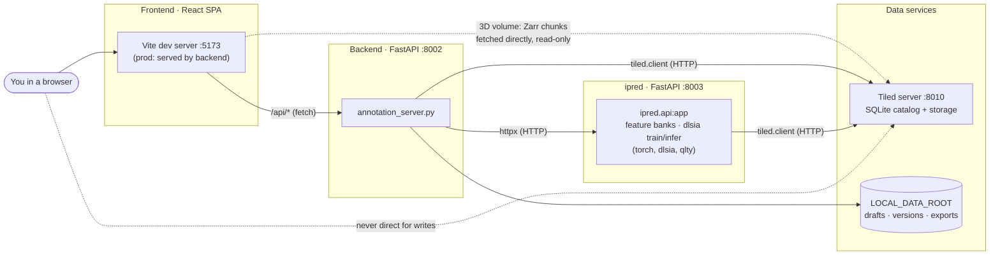
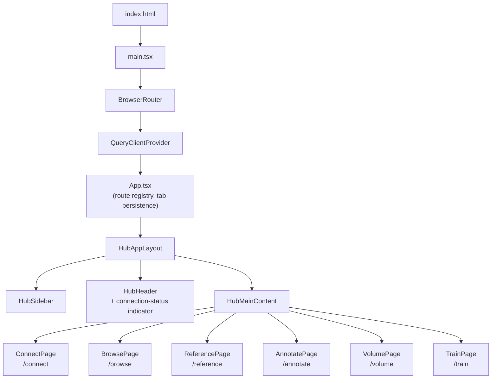
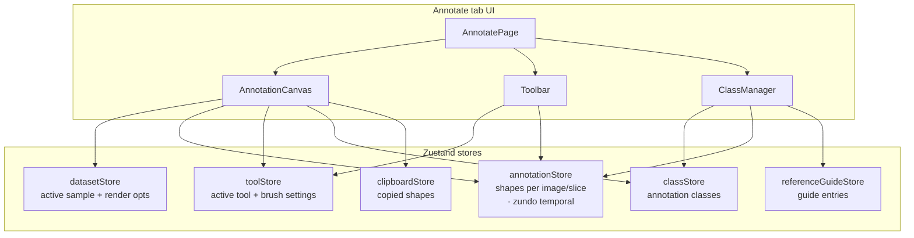
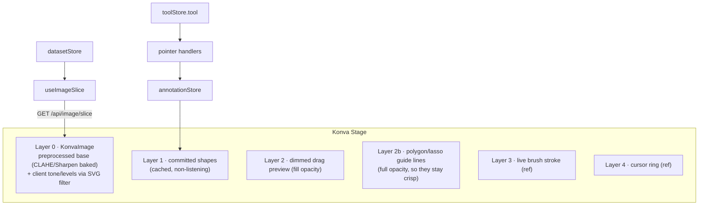
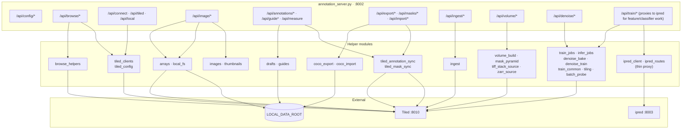
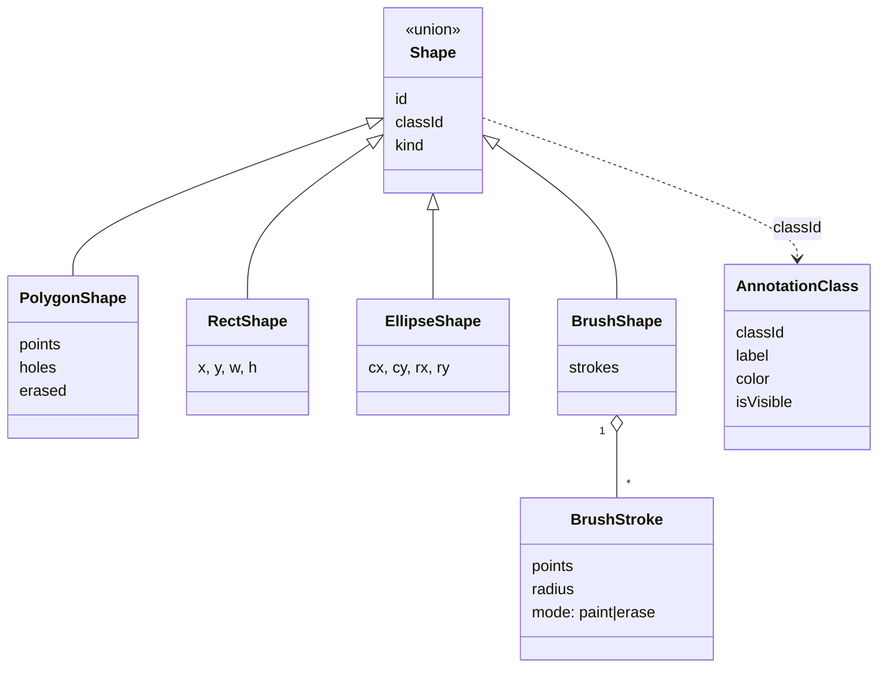
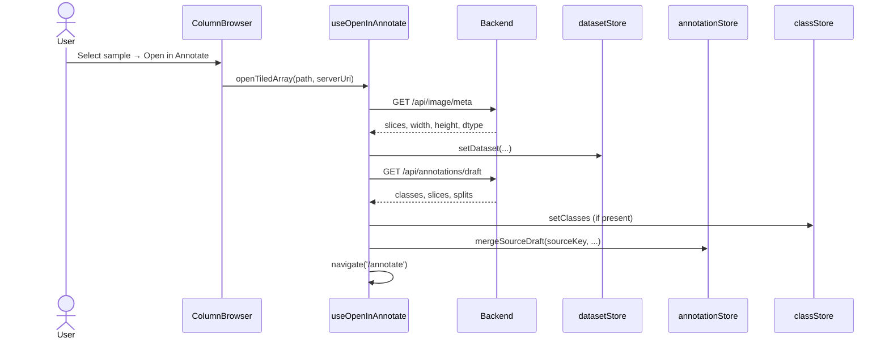
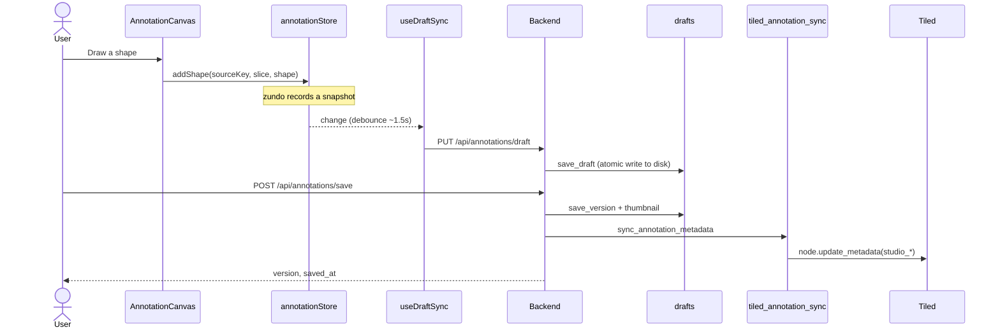
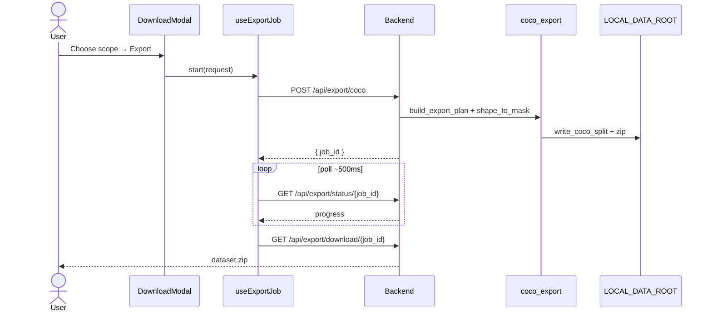
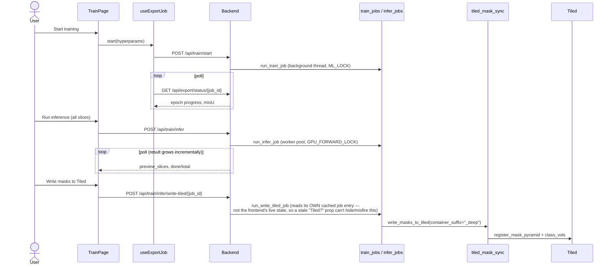

# Software architecture

This page is a developer-oriented tour of how Segmentation Annotation Studio is put
together: the major processes, the modules inside each one, and how a request
flows from a click in the browser all the way to Tiled and back.

If you only want to *use* the tool, the [Using the tool](../guide/index.md)
section is the place to start. This page is for people who want to extend,
debug, or deploy it.

## System context

The application is **four** cooperating processes (grew from three as dlsia
training/inference and the 3D volume viewer became core, always-on parts of
the stack rather than optional extras). The browser only ever talks to the
**backend**; all catalog/array access and all ML work are proxied server-side
so that Tiled credentials and model internals never reach the client.



| Component | Role | Default address |
| --- | --- | --- |
| **Frontend** | React app the annotator interacts with | <http://127.0.0.1:5173> |
| **Backend** | FastAPI: renders images, rasterizes masks, builds exports, proxies ipred | <http://127.0.0.1:8002> |
| **ipred** | FastAPI: feature banks, iPred pixel-classifier training, dlsia TUNet train/infer (GPU-capable) | <http://127.0.0.1:8003> |
| **Tiled** | Data catalog for source images and mask write-back | <http://127.0.0.1:8010> |

!!! note "The 3D viewer is the one place the browser talks to Tiled directly"
    Every other feature proxies through the backend (see
    [Security boundaries](#security-boundaries)). The 3D **Volume** view is a
    deliberate, narrow exception: the vendored WebGPU renderer streams Zarr
    chunks straight from Tiled's `/zarr/v2` router (`lib/zarrUrl.ts`) for
    performance — there is no export step or downsampled-volume endpoint in
    between. This works because anonymous **read** access is enabled on Tiled;
    the write-scoped API key never leaves the backend, and nothing here lets
    the browser write to Tiled.

## Technology stack

=== "Frontend"

    | Layer | Technology | Used for |
    | --- | --- | --- |
    | Framework | **React 18** + **TypeScript** | UI components |
    | Build/dev | **Vite 6** | Dev server, `/api` proxy, production bundle |
    | Routing | **react-router 7** | `BrowserRouter`, tab navigation |
    | Server state | **TanStack Query 5** | Caching image slices, server lists, drafts |
    | Client state | **Zustand 5** | Nine stores (see [State management](#state-management)) |
    | Undo/redo | **zundo** | Temporal middleware on the annotation store |
    | Canvas | **react-konva** / **konva** | Drawing shapes on the image |
    | Styling | **Tailwind CSS** | Utility-first styling of the Finch shell |
    | Icons | **@phosphor-icons/react** | All UI icons |
    | AI | **@huggingface/transformers** | Segment Anything (SAM) in a Web Worker |

=== "Backend"

    | Concern | Package | Used for |
    | --- | --- | --- |
    | API | **fastapi** + **uvicorn** | HTTP framework and ASGI server |
    | Catalog | **tiled[client]** | Reading/writing the Tiled catalog |
    | Arrays | **numpy** | Mask math, statistics, downsampling |
    | Images | **pillow**, **matplotlib** | PNG encode/decode, colormaps |
    | Rasterize | **scikit-image** | Polygon/ellipse/disk rasterization, contours |
    | Export | **pycocotools** | RLE encoding, bbox/area for COCO |
    | Files | **tifffile**, **imagecodecs** | Scientific TIFF reads |
    | Config | **python-dotenv** | Loading `backend/.env` |
    | ML (optional extra) | **torch**, **dlsia**, **qlty** | dlsia TUNet train/infer, tiling geometry — gated behind the `ml` install extra; the backend runs fine without it, just without the Train tab's real functionality |

=== "ipred (dlsia + pixel classifier)"

    | Concern | Package | Used for |
    | --- | --- | --- |
    | API | **fastapi** + **uvicorn** | Its own separate ASGI service, port 8003 |
    | ML | **torch**, **dlsia** | TUNet segmentation model, denoiser autoencoder |
    | Tiling | **qlty** | Patch tiling/stitching for training and inference on full-resolution slices |
    | Classical ML | **scikit-learn** | The Annotate tab's "fast" pixel classifier (iPred) |
    | Feature banks | **onnxruntime** (optional) | tomojepa/SAM embeddings for manifold-coverage sampling |
    | Device | CUDA, MPS (Apple Silicon), or CPU | `train_common.pick_device()` auto-detects, `TRAIN_DEVICE` env overrides |

## Deployment topology

The dev and production layouts differ mainly in **who serves the SPA** and
**where Tiled lives**.

=== "Development"

    ```mermaid
    flowchart LR
      Browser["Browser"]
      Vite["Vite :5173"]
      Backend["FastAPI :8002"]
      Ipred["ipred :8003"]
      Tiled["Tiled :8010"]
      Disk[("~/data")]

      Browser -->|localhost:5173| Vite
      Vite -->|"/api/* proxy"| Backend
      Backend -->|tiled.client| Tiled
      Backend -->|httpx| Ipred
      Ipred -->|tiled.client| Tiled
      Backend --> Disk
    ```

    `start_all.sh` launches all four: Tiled (`$TILED_PORT`, default 8010),
    backend (`$BACKEND_PORT`, default 8002), ipred (`$IPRED_PORT`, default
    8003), and the Vite dev server (`$FRONTEND_PORT`, default 5173) — each env
    var overridable, and each port auto-bumped to the next free one if taken.
    Vite proxies every `/api` request to the backend, so the frontend uses an
    empty `API_BASE` and stays same-origin.

=== "Production (Docker) — three images, pick one"

    Three Dockerfile targets/compose files, layered `app` → `app-ml` → `app-full`
    (each `FROM` the previous, so the install steps are never duplicated) —
    each covers a different deployment need, none replaces the others.

    **`app` (lean)** — frontend + backend only, for a deployment with its own
    external Tiled and no need for iPred/dlsia:

    ```mermaid
    flowchart LR
      Browser["Browser"]
      Container["app image :8002<br/>API + static SPA"]
      TiledExt["External Tiled<br/>(TILED_URI env)"]
      Volume[("/data volume")]

      Browser -->|same origin| Container
      Container --> TiledExt
      Container --> Volume
    ```

    **`app-ml`** — `app` plus the `ml` extra (torch/dlsia) and ipred bundled,
    Tiled still external — for a deployment that already has its own
    production Tiled (bundling a second, empty one would be wrong) but still
    wants Train/iPred to work without standing up a separate ipred service.
    This is what the `:als` ghcr.io tag publishes, base path baked in at
    `/bl832/seg_studio/`:

    ```mermaid
    flowchart LR
      Browser["Browser"]
      Container["app-ml image<br/>backend :8002 (foreground)<br/>+ ipred :8003 (background)"]
      TiledExt["External Tiled<br/>(TILED_URI env)"]
      Volume[("/data volume")]

      Browser -->|same origin| Container
      Container --> TiledExt
      Container --> Volume
    ```

    **`app-full` (batteries-included)** — `app-ml` plus a bundled Tiled server
    too, one container running all three backend-side services (Tiled and
    ipred as backgrounded processes, backend as the container's foreground/main
    process — no Docker networking needed). This is what the `:local` ghcr.io
    tag publishes, base path baked in at `/seg_studio/`:

    ```mermaid
    flowchart LR
      Browser["Browser"]
      Container["app-full image<br/>backend :8002 (foreground)<br/>+ ipred :8003 (background)<br/>+ Tiled :8010 (background)"]
      Volume[("/data volume<br/>/data/raw bind mount")]

      Browser -->|":8002 only"| Container
      Container --> Volume
    ```

    All three copy the compiled SPA into `backend/static/`; FastAPI serves the
    API and static files from one origin. Known limitation (documented in
    `docker-entrypoint-full.sh`'s/`docker-entrypoint-ml.sh`'s own comments):
    Tiled/ipred aren't supervised inside `app-full`/`app-ml` — if one crashes
    post-startup the container keeps running (backend is its main process) but
    that service stays down until a restart. Fine for local/demo use; a real
    deployment needing that resilience should use `app` against a
    properly-supervised external Tiled instead.

    **Subpath hosting** (e.g. `hub.als.lbl.gov/bl832/seg_studio/`, behind a
    reverse proxy that strips the prefix before forwarding) is a build-time
    choice, not a runtime one — Vite bakes `base`/`import.meta.env.BASE_URL`
    into the compiled JS, so a root-hosted image and a subpath-hosted image are
    two different build artifacts from the same source. Set the `VITE_BASE_PATH`
    build-arg (`vite.config.ts`'s `base`, threaded through to `main.tsx`'s
    `BrowserRouter basename` and `config.ts`'s `API_BASE`) at `docker build`
    time; leave it unset for root-hosted (local dev, and the generic
    `:latest`-tagged builds of all three images above are unaffected).

## Frontend architecture

### Component shell

The UI follows the ALS **Finch** hub pattern: a fixed icon sidebar, a header,
and a routed main area. Six tabs map to six page components.



| Tab | Route | Page component | Key children |
| --- | --- | --- | --- |
| **Connect** | `/connect` | `ConnectPage` | `IngestDropzone`, server/folder pickers |
| **Browse** | `/browse` | `BrowsePage` | `ColumnBrowser`, `LocalSampleBrowser` |
| **Reference** | `/reference` | `ReferencePage` | inline guide editors |
| **Annotate** | `/annotate` | `AnnotatePage` | `AnnotationCanvas`, `Toolbar`, `ClassManager`, stage tabs (Draw/Assist/Predict) |
| **3D** | `/volume` | `VolumePage` | `VolumeViewer` (vendored WebGPU renderer), `MaskLayersPanel`, `BuildVolumePanel`/`RebuildVolumeControl` |
| **Train** | `/train` | `TrainPage` | `TrainingDataPanel`, `HyperparamsPanel`, `RunsPanel`, `InferencePanel` |

!!! note "Export is a modal, not a tab"
    Dataset export (COCO or DINOv3/Lightly) lives in `DownloadModal`, opened from
    the Annotate sidebar — there is no dedicated Export tab in the current navigation.

`HubAppLayout` also mounts `useConnectionHealth()` once at the app-shell level
(not per-page) — it periodically checks Tiled reachability
(`GET /api/tiled/list`, backoff on failure) and drives `connectionStore.status`,
which `HubHeader` renders as a small persistent indicator (green "Tiled
connected" / red "Tiled disconnected" linking back to Connect).

### State management

State is split across a dozen **Zustand** stores. Only the annotation store
carries undo/redo history (via **zundo**), and a handful persist to
`localStorage` (display prefs are plain values inside `AnnotatePage`, not a
store — see `lib/displayPrefs.ts`).



| Store | Holds | Persistence | Undo? |
| --- | --- | --- | --- |
| `annotationStore` | `byImage[sourceKey][slice] → Shape[]`, splits, negatives | draft autosave to backend | **zundo** |
| `toolStore` | active tool, brush size, fill/threshold, selection | memory | — |
| `datasetStore` | active sample, `meta` (incl. `globalValueRange`), `currentSlice`, `renderOpts` | memory | — |
| `classStore` | `AnnotationClass[]` (id, label, color, visibility) | in draft/save payloads | — |
| `connectionStore` | tiled/local URIs, paths, sample count, **live Tiled `status`** | memory | — |
| `referenceGuideStore` | guide entries, notes, `loadedFor` | backend via `useGuideSync` | — |
| `clipboardStore` | copied shapes | memory | — |
| `settingsStore` | `annotatorName`, `colorblindMode`, anonymous `sessionId` | `localStorage` | — |
| `ratingStore` | per-sample star ratings | `localStorage` | — |
| `ipredStore` | Annotate → Assist/Predict stage state: feature bank job, trained classifier, manifold sampling | memory | — |
| `layerVisibilityStore` | per-class layer show/hide (Annotate canvas overlay) | memory | — |
| `predictedRasterStore` | pointers (`{runId, classIds}`) to committed-but-not-yet-vectorized predicted slices — see [Lazy shape vectorization](#lazy-predicted-shape-vectorization) | memory | — |

`toolStore` also carries the eraser/select scope (`eraseAllClasses`, `selectScope`),
the `clipToOtherClasses` (default **on**) and `mergeOverlappingSameClass` toggles,
and `panReturnTool` (so the brush/eraser cursor stays visible while hold-Space
panning). `settingsStore.sessionId` is an anonymous per-install id stamped into
the "Feedback" bug-report context.

### Lazy predicted-shape vectorization

A full-volume iPred "Apply across volume" commit does **not** eagerly
vectorize every predicted slice into real, editable `Shape[]` — that produced
a 297MB draft from one commit (139,004 shapes, 98.8% machine-predicted) before
this was built. Instead, `handleCommitVolumeApply` writes a lightweight
pointer (`predictedRasterStore`: `{runId, classIds}`, tens of bytes) for any
slice that doesn't already have real shapes; the existing Predictions raster
overlay (PNG-driven, not `Shape[]`-driven) keeps showing it from the run's own
`commit.png`. A slice is vectorized into real `Shape[]` — and only that slice —
the moment the user actually interacts with it ("Make this slice editable").
Export and "Push to Tiled" read straight from the pointer for any slice never
made editable, falling back to real shapes for ones that were.

### Canvas rendering

`AnnotationCanvas` stacks several **react-konva** layers. The in-progress brush
stroke is drawn imperatively through a ref to avoid a Zustand write on every
pointer move; it is committed to the store only on mouse-up.



Tools resolve to different interactions: `polygon`, `rectangle`, `ellipse`,
`brush`/`eraser`, `fill`, `select`, `pan`, plus AI-assisted `magic` (Segment
Anything or classic magic-wand) and `magnetic` (livewire). Pure geometry,
rasterization, region ops, and the SAM worker live under `src/lib/`.

The in-progress brush/erase stroke is drawn imperatively on Layer 3 (no store
write per pointer move); polygon and magnetic **guide lines** get their own
full-opacity layer (2b) so they read clearly even when the shape fill opacity is
turned down. Layer 0 shows a **preprocessed base** — CLAHE/Sharpen are baked into
an offscreen canvas so the tools (SAM encode, magic wand, magnetic edge map)
operate on the same enhanced image the user sees, while brightness/contrast/
levels/gamma/colormap stay on the GPU as an SVG filter over the top.

### Client-side geometry & tools (`src/lib/`)

The drawing tools are backed by small, pure, unit-tested modules — no backend
round-trip for editing:

| Module | Responsibility |
| --- | --- |
| `magicwand.ts` | Classic wand + mask→polygon vectorization (`maskToPolygons`, `maskToPolygonsWithHoles`) |
| `livewire.ts` | Magnetic-lasso edge-cost map, Dijkstra, least-cost `tracePath` |
| `rasterize.ts` | Shapes → binary mask (`rasterizeShapes`, `gridFor`, `fullResGridFor`) |
| `polybool.ts` | True polygon boolean ops (union/difference) via `polygon-clipping` — powers clip, merge, and eraser while **preserving existing vertices** |
| `clipToClasses.ts` / `mergeSameClass.ts` | Clip a new shape against other classes / union with overlapping same-class shapes |
| `regionOps.ts` / `morphology.ts` | Select-tool region ops: merge, grow, shrink, remove islands |
| `clahe.ts` / `sharpen.ts` / `stretch.ts` / `colormaps.ts` | Display-only preprocessors and LUTs |
| `geometry.ts` / `measure.ts` / `datasetStats.ts` | Hit-testing/util, measurement, and the Insights QA metrics |
| `sam/samClient.ts` · `sam/samWorker.ts` · `sam/adjust.ts` | SAM main-thread singleton, the Web Worker, and the display-bake used by tools |
| `displayPrefs.ts` | Persists the cosmetic display sliders (not `denoise`) to `localStorage`, global viewer preference |
| `bandTransferFunction.ts` | Converts a Sampler-fitted 2D intensity band into the 3D viewer's opacity-curve domain — see [3D volume view](#3d-volume-view) |
| `zarrUrl.ts` | Builds the Zarr URL the 3D viewer streams directly from Tiled, and the `<source>__masks[_deep]` mask URL |
| `volumeMaskPreview.ts` | Rasterizes the CURRENT (possibly unsynced) annotation shapes into a coarse class-id volume — the Fast mask slot's zero-network "Live" mode |

## 3D volume view

The `/volume` tab renders straight off Tiled, with no export step: the vendored
WebGPU renderer (`frontend/vendor/view_tomography_recon_app`, a pinned git
submodule) streams a Zarr store's chunks directly from Tiled's `/zarr/v2`
router. `VolumeViewer.tsx` owns only the React mount/dispose lifecycle around
its imperative `run(canvas, options) → WebGpuViewerInstance` API; everything
about *how* the volume looks is the vendored renderer's own concern.

### Mask layers

Two independent, fixed mask/annotation slots — "Fast (iPred)" and "Deep
(dlsia)" — backed by the viewer's own slot-neutral `loadMask`/
`loadMaskFromArray`/`setMaskClassColor`/etc. `MaskLayersPanel.tsx` is where the
*meaning* of each slot lives (kept out of the vendored viewer entirely):

- **Deep** is always Tiled-backed, pointed at the `<source>__masks_deep`
  container `tiled_mask_sync.write_masks_to_tiled` writes (`container_suffix`
  keeps it independent of the Fast slot's own container).
- **Fast** defaults to a zero-network "Live" mode: `volumeMaskPreview.ts`
  rasterizes the sample's CURRENT shapes client-side into a coarse class-id
  array, loaded via `loadMaskFromArray` — no "Push masks to Tiled" step
  required first. It can also point at the Tiled-backed `<source>__masks`
  container (the precise backend-rasterized result) via its own toggle.

Because `loadMask`/`loadMaskFromArray` are fire-and-forget on the viewer's
public interface (no promise, no error signal — `getMaskClasses(slot)`
returning `undefined` covers both "still loading" and "failed"
indistinguishably), `MaskLayersPanel.tsx` polls for up to 5 minutes rather than
assuming synchronous completion — a real Tiled-backed "Deep" mask (hundreds of
slices, freshly written) can legitimately take a while over the network, and a
short timeout only makes the *panel* look broken without stopping the
underlying load.

### Transfer function: the threshold-fit → 3D bridge

The Annotate tab's Sampler/Threshold-lasso tool fits an intensity band from a
traced example (`lib/thresholdFit.ts`) — "View band in 3D" sends that band
(native 0–255 canvas-byte space) to `/volume?bandLo=&bandHi=`, which isolates
it in the viewer's opacity curve (`setRendering({ opacityPoints })`): opaque
inside the band, transparent outside, with **zero upstream viewer changes** —
purely driving an already-existing transfer-function API. This isolates by
*intensity value* across the whole volume, not the traced *spatial region*
specifically — good enough when the traced feature's density is genuinely
distinct from its surroundings (the same property the 2D tool already
exploits), not true region-clipping.

The one real subtlety: the 2D canvas's 0–255 bytes are normalized against a
per-dataset **percentile** range (`images._sample_global_stats`, exposed to
the frontend as `ImageMeta.globalValueRange`), while the 3D viewer separately
normalizes raw voxels against its own **min/max**-based estimate
(`WebGpuViewerInstance.getValueRange()`) — different statistics from different
data, so a fitted band must be converted byte → raw physical value → the
viewer's own domain (`lib/bandTransferFunction.ts`'s
`mapByteBandToViewerDomain`), not simply divided by 255. Assuming the two
normalizations were the same was tried first and produced a visibly wrong
band (confirmed live) before this was understood.

### Volume build & rebuild

A TIFF-stack source has no pyramid to stream until one is built
(`BuildVolumePanel.tsx` → `/api/volume/build`, backed by `volume_build.py`).
`RebuildVolumeControl.tsx` re-triggers a build for a dataset that already has
one (e.g. after a fidelity setting changes) — `build_volume` safely replaces
any prior build for the same key.

## Backend architecture

The backend is a **flat module layout**: one FastAPI app (`annotation_server.py`)
declares every route directly, delegating to focused helper modules. There are no
sub-routers.



### Module responsibilities

| Module | Responsibility |
| --- | --- |
| `annotation_server.py` | FastAPI app, all HTTP routes, CORS, static SPA, caching |
| `tiled_config.py` / `tiled_clients.py` | Server config, cached clients, `api_key_for_uri`, browse-root resolution |
| `browse_helpers.py` | Metadata facets and filtered search (`tiled.queries.Key`, `distinct()`) |
| `arrays.py` / `local_fs.py` | Resolve and slice arrays from Tiled or the local filesystem |
| `images.py` / `thumbnails.py` | Slice → PNG rendering (normalize, colormap, scale) — `images._sample_global_stats` is also what `ImageMeta.globalValueRange` exposes to the frontend |
| `drafts.py` / `guides.py` | Autosave drafts, immutable version history, annotation guides |
| `coco_export.py` / `coco_import.py` | Shape rasterization, COCO build/write, dataset import |
| `export_jobs.py` / `ingest.py` | In-memory background-job registries (shared by export, dlsia train/infer, denoise, ingest — all long-running work polls the same `/status/{id}` shape) |
| `tiled_annotation_sync.py` / `tiled_mask_sync.py` | Write `studio_*` metadata and rasterized mask volumes back to Tiled — `container_suffix` keeps independent mask producers (manual sync vs. dlsia's own write) from colliding |
| `volume_build.py` / `mask_pyramid.py` / `tiff_stack_source.py` / `zarr_source.py` | Build/register the Zarr pyramid the 3D viewer streams, and the mask pyramids it loads into its two mask slots |
| `train_common.py` / `train_jobs.py` / `infer_jobs.py` / `tiling.py` / `batch_probe.py` | dlsia TUNet training/inference: device selection, run persistence, qlty patch tiling, GPU batch-size probing. Two-lock design (`ML_LOCK` for cross-job exclusivity, `GPU_FORWARD_LOCK` scoped to just the GPU forward call) lets I/O/preprocessing/vectorization run concurrently across a per-slice worker pool during inference while still serializing actual GPU calls |
| `denoise.py` / `denoise_bake.py` / `denoise_train.py` / `denoise_runtime.py` / `dlsia_runtime.py` / `autoencoder_runtime.py` | Classical + learned (Noise2Noise/Noise2Void/autoencoder) denoising, and baking a denoiser's output permanently into a new Tiled node |
| `ipred_client.py` / `ipred_routes.py` | Thin `httpx` proxy from the backend's `/api/train/*`/iPred routes to the separate ipred service — the backend never runs feature-extraction/classifier training itself |

### Data model

All shape coordinates are **image pixels** — the Konva stage transform is
display-only. Shapes are shared conceptually between the frontend store and the
backend `schemas.py`.



Samples are identified by a canonical **source key**:

- Tiled — `tiled:<serverUri>:<tiledPath>`
- Local — `local:<relPath>`

The same key is used by the stores, draft autosave, versioned saves, the
annotation guide, and export, so every artifact for a sample lines up.

## Key request flows

### Open a sample for annotation

Selecting a sample in Browse loads its metadata and any existing draft, then
navigates to the Annotate tab.



### Draw, autosave, and save a version

Drawing mutates the annotation store (recorded by zundo). A debounced autosave
writes a crash-recovery **draft**; an explicit **save** creates an immutable
version and syncs metadata to Tiled.



### Export a dataset

Export runs as a background job. The client polls for status and downloads the
finished `.zip`. The `format` field selects the writer: **COCO (SAM3)**
(`write_coco_split` — RLE + images + semantic/per-class masks) or **DINOv3 /
Lightly** (`write_lightly_split` — `images/` + `masks/` label PNGs with matching
stems + `classes.json`). Both share the same rasterization and zip plumbing.



### Train a dlsia model, run inference, write masks to Tiled

The Train tab's whole loop stays in the backend's `train_jobs.py`/`infer_jobs.py`
— the ipred service is only involved for the Annotate tab's own fast pixel
classifier and feature banks, not dlsia. `run_infer_job` runs a per-slice
worker pool (I/O/preprocessing/vectorization concurrent, GPU forward calls
serialized via `GPU_FORWARD_LOCK`) and publishes partial results incrementally
so the frontend's preview slider extends live while the job is still running,
not just after it finishes.



!!! note "Why the write-tiled route trusts itself, not the frontend"
    `run_write_tiled_job` derives `source`/`kind` from its own cached job entry,
    never from the request. This was a deliberate fix (#31 in the project's
    working notes): a frontend prop computed from the *live* dataset store can
    go stale if the user navigates away during a long job and back, which once
    silently hid the "Write masks to Tiled" button for a job that had, in
    fact, run against a real Tiled source. Trusting the job's own record — and
    letting the backend's already-correct rejection of a genuinely non-Tiled
    source surface as a normal job error — is more robust than re-deriving the
    same fact twice.

## Key design decisions

The choices below explain *why* the code looks the way it does — useful before
extending it.

- **Backend renders pixels; the browser never sees raw arrays.** `/api/image/slice`
  returns an 8-bit PNG (normalize → scale → colormap). This keeps scientific dtypes
  and Tiled credentials server-side, makes the frontend format-agnostic, and lets
  the backend expose raw intensities only where needed (e.g. `/api/measure`).
- **Shapes are stored in image-pixel coordinates.** The Konva stage transform is
  display-only, so annotations are resolution-independent and line up exactly with
  the array — no zoom-dependent rounding.
- **Display enhancement is baked for the tools, filtered for the eye.** Nonlinear
  preprocessors (CLAHE, Sharpen) are baked into an offscreen base so SAM/wand/livewire
  act on what you see; the cheap linear chain (brightness/contrast/levels/gamma/
  colormap) stays on the GPU as an SVG filter. None of it changes exported pixels.
- **Editing uses true polygon boolean geometry at full resolution.** Clip, merge, and
  erase go through `polygon-clipping` (`polybool.ts`), not a mask round-trip, so
  **untouched vertices are preserved** and repeated edits don't erode a region; the
  eraser rebuilds a polygon's vertices to match the carved outline and can split
  shapes or open holes. Rasterization uses `fullResGridFor` to avoid downsampling
  drift.
- **Brush blobs are connected components.** Overlapping strokes grow one shape; a
  disconnected stroke starts a new shape, so each blob is independently selectable.
- **AI runs in the browser, offline-first.** SAM (SlimSAM via `@huggingface/transformers`)
  runs in a Web Worker, WebGPU with a WASM fallback, loading vendored local weights
  first and only falling back to the HF CDN. No server GPU or model calls.
- **Two-tier persistence.** A debounced **draft** autosaves for crash recovery
  (`/api/annotations/draft`, disk only); an explicit **save** writes an immutable
  version + thumbnail and syncs summary metadata to Tiled. Everything is keyed by the
  canonical **source key** so drafts, versions, guide, and exports line up per sample.
- **Long work is a background job + poll.** Export, mask write-back, dlsia train/infer,
  denoising, and ingest all use the same in-memory job registry (`export_jobs.py`)
  with a `/status/{id}` poller, rather than blocking the request.
- **Fill flood-time barriers reuse the same rasterizer as post-commit clipping.**
  The Fill tool's flood (`magicwand.ts`) can now stop at a pixel already
  claimed by a different class (an optional `blocked` grid, OR'd into the
  existing gradient-edge wall check) — built via `rasterizeUnion`, the exact
  helper the brush-clip-detection path already used, so no second
  rasterization concept was introduced for the same problem.
- **Every mask sync/pyramid write is keyed by its own real cache path, not a
  shared literal.** `mask_pyramid.register_mask_pyramid` takes a `cache_key`
  (the actual on-disk Zarr path) separate from `key` (the Tiled sub-node
  name, always `"semantic"`) — a real production incident (two independent
  mask producers silently overwriting each other's pixels) came from a
  version that conflated the two.

## Security boundaries

These invariants are enforced across the codebase (see `AGENTS.md`):

- **The frontend never calls Tiled directly.** Every catalog read, array slice,
  and mask write goes through the backend API.
- **Tiled API keys never reach the browser.** `/api/config/servers` returns only
  `has_api_key: bool`; keys are resolved server-side via `api_key_for_uri()`.
- **Local services bind to `127.0.0.1`**, never `0.0.0.0`.
- **Tiled writes require intent** — metadata sync, mask write-back, and ingest are
  explicit actions, not side effects of browsing.
